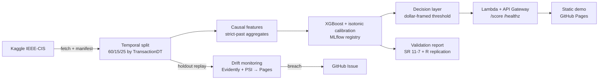

# Fraud Detection Model + Validation Package

**The objective here is decision quality and validation rigor — not leaderboard AUC.**
This project is deliberately *not* tuned to, compared against, or benchmarked on the
Kaggle IEEE-CIS leaderboard. It treats the model as the easy part and the decisions
around it as the product: leakage-proof temporal validation, calibrated probabilities,
a dollar-framed operating point, a deployed scoring API, replayed drift monitoring, and
an SR 11-7-style validation document — built and documented the way a bank's model-risk
function would expect to review it.

> **Synthetic-data caveat.** This build ran without Kaggle credentials, so every number
> below is from a **schema-identical synthetic fixture** (clearly labelled throughout).
> The pipeline reproduces the **real** IEEE-CIS results with one command the moment
> credentials are supplied — nothing about the machinery is synthetic.

## What it does



## Headline results (synthetic, illustrative)

**The leakage experiment** — same features, same model, two validation protocols
([full grid](docs/experiments.md)):

| model | temporal-val PR-AUC | random-CV PR-AUC | inflation |
| --- | --- | --- | --- |
| logistic regression | 0.253 | 0.359 | **+42%** |
| XGBoost | 0.377 | 0.470 | **+25%** |
| LightGBM | 0.409 | 0.469 | **+15%** |

Random cross-validation trains on future-dated rows and reports an optimistic number.
That inflation is why every split in this project is temporal.

**Holdout** (isotonic-calibrated XGBoost): PR-AUC **0.308**, ROC-AUC **0.909**, Brier
**0.023**. **Operating point:** captures **35.9% of fraud value at 1.65% FPR** for
**≈ $236k net per 100k transactions** (review cost $25), optimized on validation and
reported on the temporal holdout. Independently reproduced in R
([`docs/validation_r/`](docs/validation_r/replication.Rmd)).

## Read the work

| Artifact | What it is |
| --- | --- |
| [Validation report](docs/validation_report.md) | SR 11-7 / SR 26-2-style model validation, cites every artifact |
| [Model card](docs/model_card.md) | one-page standard fields |
| [Decision report](docs/decision_report.md) | dollar-framed cost model, operating point, SHAP |
| [Experiments](docs/experiments.md) | full grid, leakage table, calibration, registry |
| [R replication](docs/validation_r/replication.Rmd) | independent recompute (effective challenge) |
| [EDA notebook](docs/notebooks/eda.ipynb) | class balance, distributions, missingness, coverage |
| [Decisions log](docs/decisions.md) | consequential choices + rationale |
| [Infrastructure](infra/README.md) | Terraform + cost projection + deploy runbook |

## How to run

```bash
uv sync                                        # core env + dev tools
uv run python -m tooling.preflight             # environment + credential check
uv run ruff check . && uv run pytest           # lint + tests (incl. causality tests)

# With Kaggle credentials (real data); otherwise everything falls back to the fixture:
uv run python -m pipeline.fetch_data           # Kaggle pull + manifest
uv run python -m pipeline.train --full         # train, calibrate, register (MLflow)
uv run python -m pipeline.evaluate --report    # decision report + figures + R scores
uv run python -m monitoring.replay_week --all  # replay the holdout → drift reports
uv run python -m serving.artifact              # build the serving bundle
docker build -t fraud-scoring .                # Lambda image (serving)
terraform -chdir=infra validate                # infrastructure (apply is owner/CI)
```

## What's shipped

Reproducible pipeline · the leakage experiment · calibrated holdout metrics ·
dollar-framed thresholds + sensitivity · SHAP · MLflow registry · Terraform-defined
scoring API (Lambda + API Gateway, throttled, billing-alarmed) · static demo · replayed
Evidently + PSI monitoring with breach → Issue · uptime check · SR 11-7-style validation
document + model card + R replication. Serving/infra are **authored**; the public
`terraform apply` is the owner's gated action (never the agent's).

## Design constraints (non-negotiable)

- **Temporal integrity is the project.** Every split is by `TransactionDT`; every entity
  aggregate is strictly past-only; property + brute-force tests enforce it. Random CV
  appears in exactly one place — the leakage experiment — labelled as the anti-pattern.
- **Calibration is not optional.** No probability is displayed unless it is calibrated.
- **Honesty labels travel with the numbers.** Monitoring is a replayed simulation on a
  static dataset; every page says so. The validation document carries the label-lag
  caveat. Raw competition data is never committed.

## Limitations

Anonymized `V*`/`id_*` features cap interpretability; the holdout is a single out-of-time
slice; production fraud labels lag weeks (this replay has them immediately); all numbers
are synthetic until rerun on real data. Full treatment:
[validation report §6](docs/validation_report.md#6-limitations).
