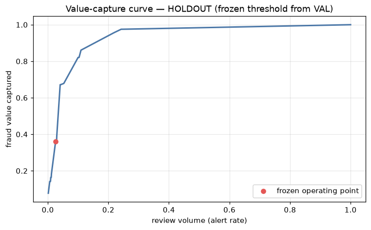
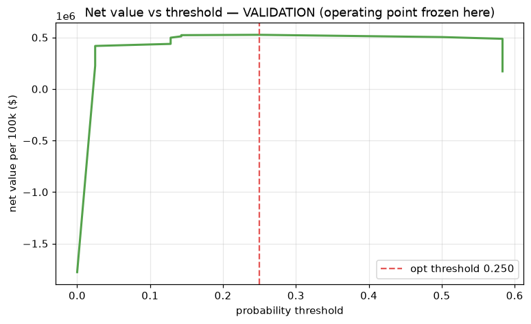
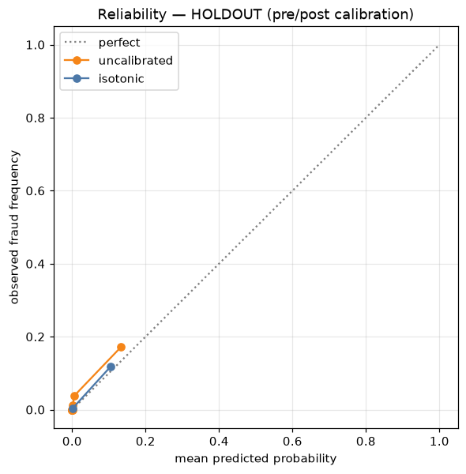
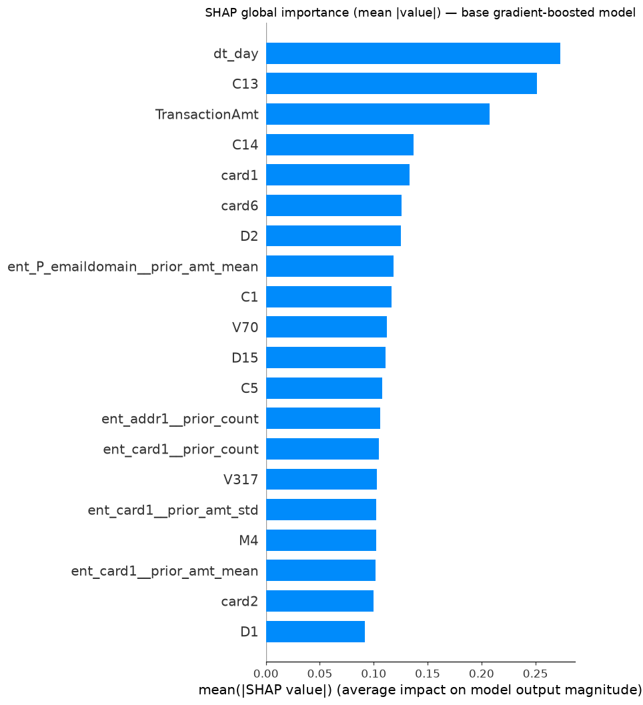
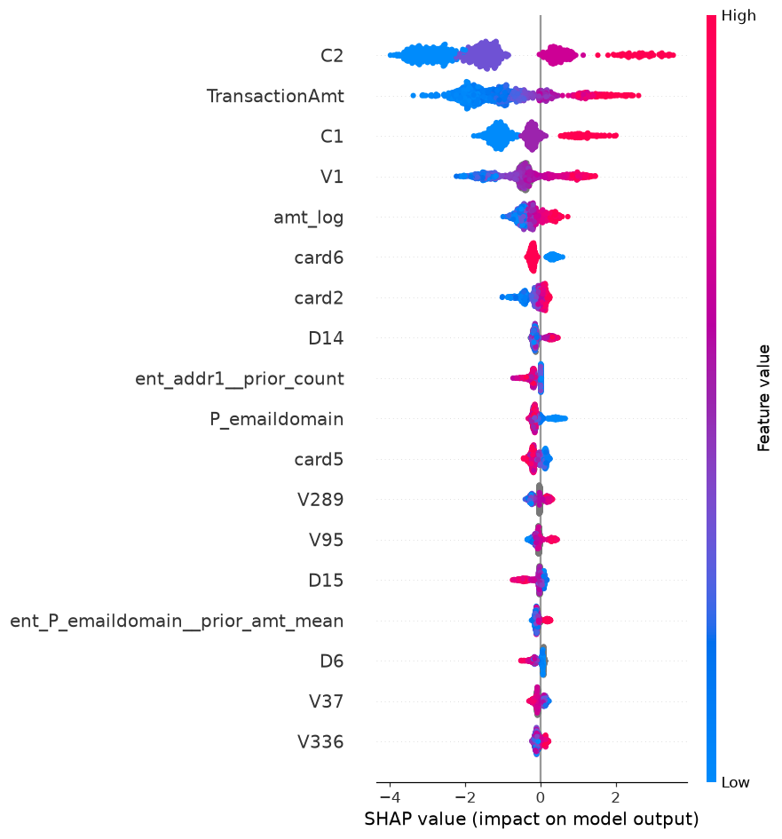

# Decision report — is this model worth operating?

> **SYNTHETIC FIXTURE — illustrative, NOT results.** Numbers are from the schema-identical synthetic fixture (SPEC Section 10); the decision framework is real. Regenerate on real data with `uv run python -m pipeline.evaluate --report`.

This report is written for a reviewer deciding whether to **operate** the model, not how it was trained. Everything is framed in dollars.

## 1. Cost model

- Reviewing a transaction costs **$25** (business parameter).
- Catching a fraudulent transaction saves its `TransactionAmt` (loss avoided).
- A missed fraud loses its `TransactionAmt`.
- **Net value** of an operating point = fraud dollars caught − review cost × alerts.

The threshold is optimized on **VALIDATION** and reported on **HOLDOUT** — never tuned on the data it is reported on.

## 2. Operating point

**At the frozen operating point (threshold 0.2500, review cost $25), the model captures 35.9% of fraud value at a 1.65% false-positive rate, for approximately $236,371 net value per 100k transactions (SYNTHETIC — illustrative).**

| metric | VALIDATION (optimized) | HOLDOUT (reported) |
| --- | --- | --- |
| threshold | 0.2500 | 0.2500 (frozen) |
| alert rate | 2.93% | 2.56% |
| recall (count) | 55.6% | 34.3% |
| false-positive rate | 1.64% | 1.65% |
| fraud value captured | 82.9% | 35.9% |
| net value / 100k | $525,692 | $236,371 |

The holdout capture is lower than validation: an out-of-time slice under drift is genuinely harder, and the frozen threshold does not perfectly transfer. Net value remains positive, and the gap is exactly what ongoing monitoring watches (validation report Section 7).

## 3. Review-cost sensitivity

How the optimal operating point shifts as the review-cost assumption varies ($5–$75). Higher review cost → higher threshold → fewer, higher-precision alerts.

| review cost | opt threshold | alert rate | recall | fpr | value capture | net / 100k |
| --- | --- | --- | --- | --- | --- | --- |
| $5 | 0.0247 | 18.67% | 100.0% | 16.67% | 100.0% | $628,892 |
| $15 | 0.2500 | 2.93% | 55.6% | 1.64% | 82.9% | $555,025 |
| $25 | 0.2500 | 2.93% | 55.6% | 1.64% | 82.9% | $525,692 |
| $50 | 0.5000 | 1.87% | 44.4% | 0.82% | 76.2% | $457,076 |
| $75 | 0.5000 | 1.87% | 44.4% | 0.82% | 76.2% | $410,409 |

## 4. Calibration

Holdout Brier 0.0228. Under class imbalance the Brier score is dominated by the rare-positive base rate; the reliability curve is the real check. Isotonic calibration corrects the probability *level* the dollar thresholds depend on. Where the holdout curve departs from validation, that is calibration drift.

## 5. Feature attribution (SHAP)

Global importance on the base XGBoost (TreeExplainer). **Caveat:** many inputs are anonymized Vesta `V*` / `id_*` features with no published meaning, so SHAP shows *which engineered inputs* move a score, not a mechanistic business reason.

### Case studies (HOLDOUT)

**Fraud** — actual label 1, calibrated P(fraud) 0.583, amount $361.83 → **ALERT** at threshold 0.250.

| feature | value | SHAP |
| --- | --- | --- |
| C2 | 3.000 | +2.327 |
| TransactionAmt | 361.830 | +1.156 |
| C1 | 2.000 | +0.588 |
| V290 | 2.918 | -0.451 |
| ent_addr1__prior_count | 6.000 | -0.433 |
| V309 | 1.083 | -0.398 |

**Legit** — actual label 0, calibrated P(fraud) 0.000, amount $148.78 → **pass** at threshold 0.250.

| feature | value | SHAP |
| --- | --- | --- |
| C2 | 0.000 | -3.366 |
| V1 | -1.381 | -1.727 |
| C1 | 0.000 | -0.943 |
| TransactionAmt | 148.780 | -0.340 |
| card6 | 2.000 | -0.237 |
| D14 | 88.130 | -0.203 |

**Borderline** — actual label 0, calibrated P(fraud) 0.250, amount $197.42 → **ALERT** at threshold 0.250.

| feature | value | SHAP |
| --- | --- | --- |
| C1 | 0.000 | -1.151 |
| V1 | 1.484 | +0.798 |
| C2 | 2.000 | +0.489 |
| V289 | -1.804 | -0.337 |
| TransactionAmt | 197.420 | +0.305 |
| V95 | 1.100 | +0.304 |

## 6. Limitations

- Anonymized features cap semantic interpretation (above).
- Holdout is a single out-of-time slice; live performance depends on drift, tracked by the monitoring layer (Section 6).
- Fraud labels arrive weeks late in production; this replay has them immediately — the label-lag caveat travels with every number that leaves the repo.
- **All figures above are on synthetic data** (SPEC Section 10).
