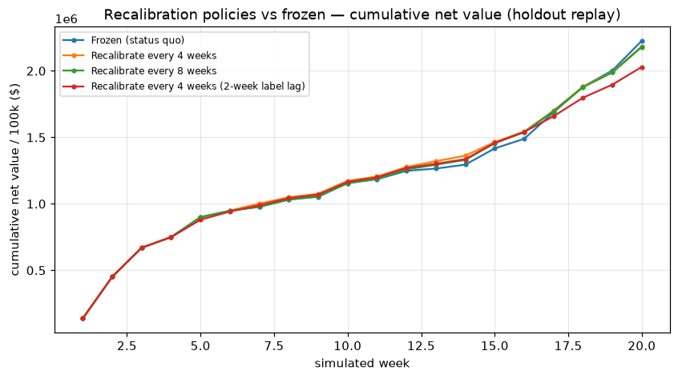

# Recalibration-policy replay experiment

> **Monitoring-policy simulation** (IMPROVEMENTS G2). It does **not** change the frozen headline operating point and never feeds model selection. It measures how much of the out-of-time degradation periodic recalibration recovers over the holdout replay (20 simulated weeks, provenance **real**).

**Recalibration** = refit isotonic + re-optimize the threshold on a trailing 8-week labelled window (the base model is never retrained). The lag variant assumes labels arrive 2 weeks late (the realistic case).

- Validation-optimal net value: **$250,929** / 100k
- Frozen out-of-time (holdout) net value: **$111,348** / 100k
- Out-of-time degradation to recover: **$139,581** / 100k

| policy | mean net / 100k | recovered vs frozen |
| --- | --- | --- |
| Frozen (status quo) | $111,348 | $+0 |
| Recalibrate every 4 weeks | $109,235 | $-2,113 |
| Recalibrate every 8 weeks | $109,012 | $-2,336 |
| Recalibrate every 4 weeks (2-week label lag) | $101,496 | $-9,852 |

**Reading.** No recalibration policy recovers the loss — every one lands *below* the frozen point, and the realistic label-lag variant is the worst. The out-of-time degradation is a **feature-distribution shift the frozen base model cannot track through calibration alone**; refitting the isotonic map + threshold on a short, noisy trailing window only adds variance, and a 2-week label lag compounds it. The result vindicates **freezing** the operating point rather than chasing trailing windows, and identifies **retraining** (not recalibration) as the correct response to sustained drift.

